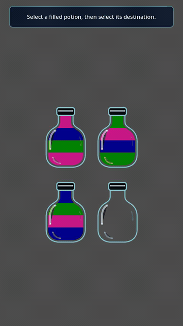

# Potion Puzzle

A Godot 4 liquid-sorting puzzle with animated fluid levels, constrained pours,
selection feedback, and corks that seal completed single-color potions.

**[Play or install Potion Puzzle](https://michaelnavazhylau.github.io/potion-tracker/)**

[](demos/potion_solution.mp4)

The portrait demo above automatically plays through a valid solution using the
mobile-friendly 2×2 layout. Select a filled potion, then select a destination.
A pour is allowed only when the destination is empty or its top color matches
the source's top color. Consecutive matching layers move together, subject to
the destination's remaining capacity.

## Run the game

1. Open `project.godot` in Godot 4.7 or later.
2. Run the project with <kbd>F5</kbd>.
3. Click or tap one potion to select it, then choose a valid destination.

When a potion becomes full with a single color, a cork drops behind the bottle
rim and seals it. Solve the puzzle by separating every color into its own full,
corked potion.

## Re-record the demo

The deterministic solution driver is in `demos/solution_demo.gd`. With Godot
and FFmpeg available, regenerate the portrait AVI, Mac-compatible MP4, and
autoplaying GIF with:

```sh
./demos/record_demo.sh
```

The script temporarily applies `demos/portrait-recording.cfg`, records at
720×1280 and 30 FPS, restores the normal responsive project configuration,
then creates a 720×1280 H.264 MP4 and a 360×640 optimized GIF.

## Export for the Web

The repository includes a single-threaded `Web` preset and uses Godot's
Compatibility renderer. With the Godot 4.7.1 Web templates installed, create a
release build with:

```sh
godot --headless --path . \
  --export-release Web build/web/index.html
```

Test the generated files through a local HTTP server:

```sh
python3 -m http.server 8000 --directory build/web
```

Then open `http://127.0.0.1:8000`. The generated `build/` directory is ignored
by Git.

The Web preset is also configured as an installable PWA with a manifest,
service worker, offline fallback, standalone display mode, and the provisional
**Prism Flask** icon. See [the three logo options](assets/pwa/logo-options.png)
and [their design notes](assets/pwa/README.md).

The public site is served from the repository's `gh-pages` branch. Generated
files remain out of `main`; rebuild `build/web` before publishing a new Pages
release.

## License

Potion Puzzle is open-source software available under the [MIT License](LICENSE).
